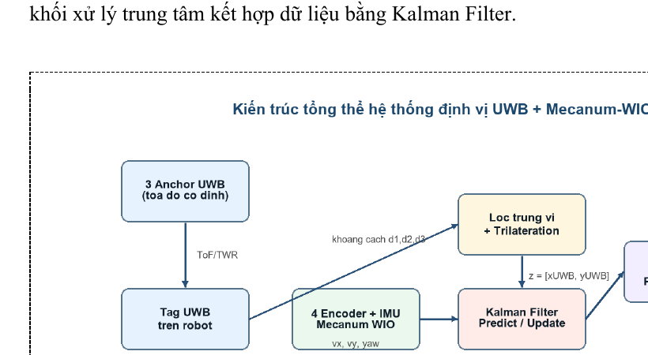
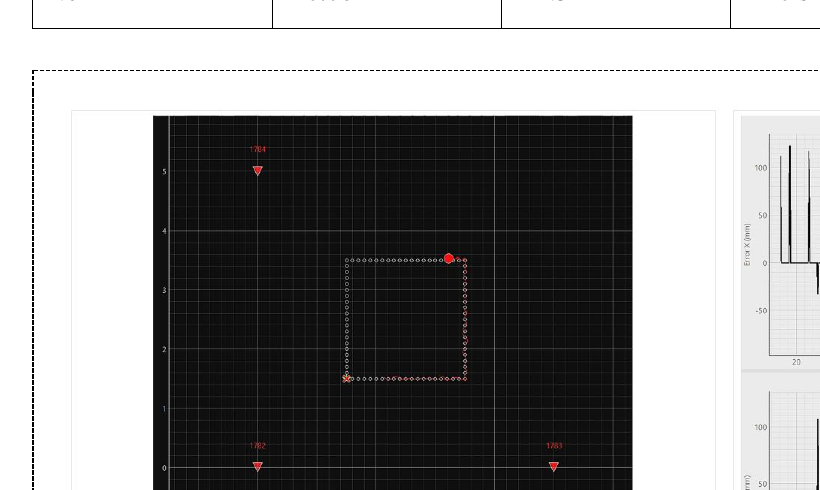

# UWB Mecanum AGV Localization

Dự án này xây dựng một mô hình robot Mecanum tự hành trong nhà, tập trung vào bài toán định vị khi GPS không sử dụng được. Robot lấy vị trí tuyệt đối từ ba anchor UWB, đồng thời tính chuyển động ngắn hạn từ encoder và IMU. Hai nguồn dữ liệu được kết hợp bằng Kalman Filter trước khi đưa vào bộ điều khiển bám waypoint.

Mục tiêu của nhóm không phải tạo một nền tảng AMR hoàn chỉnh, mà là làm rõ ba câu hỏi: UWB định vị được robot trong nhà đến mức nào, odometry trôi ra sao khi robot chạy lâu, và việc kết hợp hai nguồn dữ liệu có giúp quỹ đạo ổn định hơn hay không.



## Dự án làm được gì?

- Đo khoảng cách từ UWB Tag đến ba Anchor DW1000.
- Tính vị trí 2D bằng trilateration.
- Tính Mecanum wheel-inertial odometry từ bốn encoder và góc yaw của IMU.
- So sánh ba chế độ định vị: Odometry, UWB và Kalman Filter.
- Điều khiển robot tiến, lùi, đi ngang và quay tại chỗ.
- Tạo quỹ đạo bằng tọa độ, click chuột, vẽ tay, hình vuông hoặc hình tròn.
- Theo dõi vị trí, quỹ đạo và sai số trên giao diện PyQt6.

## Cách hệ thống hoạt động

1. Ba UWB Anchor được đặt tại các tọa độ đã đo trước.
2. UWB Tag trên robot đo khoảng cách đến từng Anchor và gửi dữ liệu qua UART cho Gateway.
3. Gateway phát dữ liệu UWB về máy tính bằng UDP.
4. ESP32 trên robot đọc bốn encoder và MPU9250, sau đó gửi RPM cùng góc yaw về máy tính.
5. Chương trình Python dùng odometry cho bước dự đoán và UWB cho bước cập nhật của Kalman Filter.
6. Bộ PID vị trí tạo vận tốc thân robot; động học nghịch Mecanum chuyển vận tốc này thành RPM cho bốn bánh.
7. ESP32 đóng vòng PID tốc độ từng bánh và gửi PWM xuống mạch công suất động cơ.

## Phần cứng chính

| Thành phần | Vai trò |
|---|---|
| Robot 4 bánh Mecanum | Di chuyển đa hướng |
| 4 động cơ JGB37-520 có encoder | Truyền động và đo tốc độ bánh |
| ESP32 | Điều khiển, truyền UDP và xử lý dữ liệu cảm biến |
| 3 UWB Anchor + 1 UWB Tag dùng DW1000 | Đo khoảng cách và định vị tuyệt đối |
| MPU9250 | Đo vận tốc góc và ước lượng yaw |
| OLED SH1106 | Hiển thị trạng thái tại robot |
| Máy tính chạy Python | Trilateration, Kalman, PID vị trí và GUI |

## Công nghệ sử dụng

- Firmware: Arduino framework cho ESP32, C/C++.
- Giao tiếp: SPI, UART, I2C, Wi-Fi và UDP.
- Định vị: UWB Two-Way Ranging, trilateration 2D.
- Ước lượng: median filter, low-pass filter và Kalman Filter.
- Điều khiển: động học thuận/nghịch Mecanum, PID vị trí và PID tốc độ bánh.
- Phần mềm máy tính: Python, NumPy, PyQt6 và PyQtGraph.

## Cấu trúc thư mục

```text
firmware/
├── uwb_anchor_1/          # Anchor địa chỉ 0x1782
├── uwb_anchor_2/          # Anchor địa chỉ 0x1783
├── uwb_anchor_3/          # Anchor địa chỉ 0x1784
├── uwb_tag/               # Tag, lọc khoảng cách và tạo JSON
├── uwb_gateway/           # Chuyển UART từ Tag sang UDP
└── mecanum_controller/    # Encoder, IMU, PID tốc độ và UDP

software/
├── main.py                # Fusion, trilateration và điều khiển waypoint
├── gui_app.py             # Giao diện điều khiển và giám sát
├── config.example.py      # Cấu hình mẫu
└── requirements.txt

docs/
└── images/                # Hình dùng trong README
```

## Cài đặt

### 1. Chuẩn bị phần mềm Python

```bash
cd software
python -m venv .venv
```

Kích hoạt môi trường ảo:

```bash
# Windows
.venv\Scripts\activate

# Linux/macOS
source .venv/bin/activate
```

Cài thư viện:

```bash
pip install -r requirements.txt
```

Sao chép cấu hình mẫu:

```bash
# Windows
copy config.example.py config.py

# Linux/macOS
cp config.example.py config.py
```

Mở `config.py` và cập nhật:

- IP của ESP32 điều khiển robot.
- Tọa độ thực của từng UWB Anchor.
- Đường kính bánh xe và kích thước động học nếu cơ khí khác mô hình gốc.

### 2. Cấu hình Wi-Fi cho ESP32

Trong hai thư mục sau:

- `firmware/uwb_gateway/`
- `firmware/mecanum_controller/`

sao chép `wifi_config.example.h` thành `wifi_config.h`, rồi điền SSID và mật khẩu. Tệp `wifi_config.h` đã được đưa vào `.gitignore` để tránh đăng thông tin mạng lên GitHub.

### 3. Nạp firmware

Thứ tự dễ kiểm tra nhất:

1. Nạp lần lượt ba Anchor và kiểm tra địa chỉ `1782`, `1783`, `1784`.
2. Nạp UWB Tag và xác nhận Serial Monitor có khoảng cách hợp lệ.
3. Nối UART giữa Tag và Gateway, chung GND, rồi nạp Gateway.
4. Nạp firmware Mecanum Controller, giữ robot đứng yên trong 10 giây để hiệu chỉnh gyro.
5. Kiểm tra máy tính nhận UDP ở cổng `4121` và `4210` trước khi đặt robot xuống sàn.

Các thư viện Arduino cần có:

- `DW1000` / `DW1000Ranging`
- `Adafruit GFX Library`
- `Adafruit SH110X`
- `MPU9250_asukiaaa`

### 4. Chạy giao diện

```bash
cd software
python main.py
```

Trên giao diện, đặt vị trí ban đầu, chọn chế độ định vị, tạo quỹ đạo rồi mới cho robot chạy. Nút dừng trên giao diện chỉ là dừng qua mạng; khi thử nghiệm nên có thêm công tắc ngắt nguồn động cơ bằng phần cứng.

## Kết quả thực nghiệm

Kết quả dưới đây được tổng hợp từ bộ dữ liệu thực nghiệm của nhóm. Chúng phản ánh cấu hình robot, vị trí Anchor, mặt sàn và thông số PID tại thời điểm đo; khi lắp đặt lại cần hiệu chuẩn trước khi so sánh.

### Sai số định vị trung bình

| Phương pháp | MAE |
|---|---:|
| UWB | khoảng 0.174 m |
| Wheel-Inertial Odometry | khoảng 2.463 m |
| Kalman Filter: UWB + WIO | khoảng 0.068 m |

Trong bộ dữ liệu này, Kalman Filter giảm ảnh hưởng của độ rung UWB và đồng thời hạn chế sai số trôi của odometry. Sai số trung bình sau fusion vào khoảng 6.8 cm.

### Thử nghiệm chạy thẳng

| Quãng đường | Sai số đến đích trung bình | Sai số góc trung bình | Thời gian |
|---:|---:|---:|---:|
| 0.5 m | khoảng 0.03 m | dưới 1.5° | khoảng 6 s |
| 1.0 m | khoảng 0.04 m | dưới 2.0° | khoảng 10 s |
| 1.5 m | khoảng 0.05 m | dưới 2.0° | khoảng 15 s |
| 2.0 m | khoảng 0.06 m | dưới 2.5° | khoảng 20 s |

Ở bài thử nhiều waypoint, sai số lệch ngang được ghi nhận dưới 6 cm; điểm cuối lệch khoảng 4.5 cm và 1.8°.



## Những giới hạn hiện tại

- Hệ thống cần đủ ba khoảng cách UWB để giải vị trí 2D.
- UWB vẫn bị ảnh hưởng bởi che khuất và truyền đa đường.
- Odometry Mecanum nhạy với trượt con lăn và sai số đường kính bánh.
- Góc yaw hiện chủ yếu dựa trên gyro nên vẫn có thể trôi khi chạy lâu.
- Chưa có lập bản đồ, tránh vật cản hoặc lập kế hoạch đường đi tự động.
- Thuật toán cấp cao chạy trên máy tính, vì vậy robot phụ thuộc vào Wi-Fi.
- Đây là mã nguồn nghiên cứu; cần kiểm tra chiều bánh, encoder, driver và nút dừng phần cứng trước khi chạy robot thật.

## Hướng phát triển

Những bước tiếp theo phù hợp nhất là thêm anchor thứ tư và least-squares, đưa yaw cùng gyro bias vào EKF, ghi log có timestamp, tích hợp cảm biến tránh vật cản, sau đó chuyển các khối định vị và điều khiển sang ROS 2 để dùng với Nav2.

## Nhóm thực hiện

- Phạm Văn Đệ
- Nguyễn Phương Duy
- Vũ Trọng Tâm
- Nguyễn Văn Nam

Giảng viên hướng dẫn: ThS. Nguyễn Lê Tường.

## Giấy phép

Dự án được phát hành theo MIT License. Trước khi public, các thành viên trong nhóm nên thống nhất việc cho phép sử dụng lại mã nguồn.
